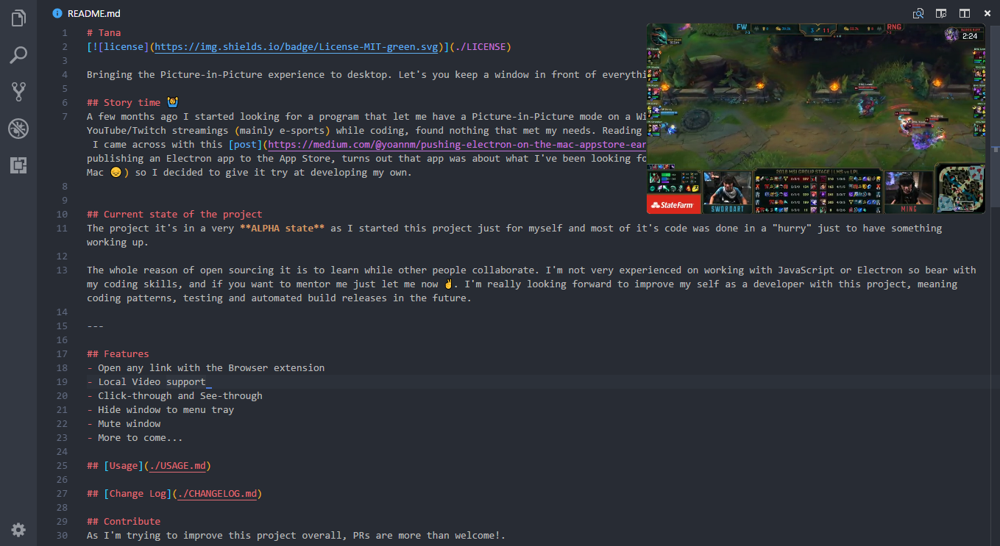

# Tana
[](./LICENSE)

Bringing the Picture-in-Picture experience to desktop. Let's you keep a window in front of everything, whether it is a webpage or a video.



## Story time 🙌
A few months ago I started looking for a program that let me have a Picture-in-Picture mode on a Windows machine, primarily to watch Netflix and YouTube/Twitch streamings (mainly e-sports) while coding, found nothing that met my needs. Reading on [electron's reddit](https://www.reddit.com/r/electronjs/) I came across with this [post](https://medium.com/@yoannm/pushing-electron-on-the-mac-appstore-early-stages-7dcb85936f92/), it's about the process of publishing an Electron app to the App Store, turns out that app was about what I've been looking for, but sadly it's only available on MacOS (Can't afford a Mac 😔) so I decided to give it try at developing my own.

## Current state of the project
The project it's in a very **ALPHA state** as I started this project just for myself and most of it's code was done in a "hurry" just to have something working up.

The whole reason of open sourcing it is to learn while other people collaborate. I'm not very experienced on working with JavaScript or Electron so bear with my coding skills, and if you want to mentor me just let me now ✌️. I'm really looking forward to improve my self as a developer with this project, meaning coding patterns, testing and automated build releases in the future.

---

## Features
- Open any link with the Browser extension
- Local Video support
- Click-through and See-through
- Hide window to menu tray
- Mute window
- More to come...

## [Usage](./USAGE.md)

## [Change Log](./CHANGELOG.md)

## Contribute
As I'm trying to improve this project overall, PRs are more than welcome!.

## Ideas/Suggestions
I'm completely open to new ideas and suggestions! Put up an [issue](https://github.com/jMavarez/Tana/issues) or send me an [email](mailto:josuemavarez@gmail.com?Subject=Tana%20-%20Idea/Suggestion).

## Future Features
Check out the [Feature tag in Issues](https://github.com/jMavarez/Tana/labels/feature) to see all in progress and upcoming ideas.

## Development

```
  npm install
  npm run install-ffmpeg ---> Run only the first time you clone the repo
  npm run dev
```

## Chrome Extension

To open any link from your Chrome Browser you need to add the chrome-extension, which is not available on the store just yet but, you can add it manually:

  1. Go to ```chrome://extensions``` on your Chrome Browser.
  2. Check ```Developer mode``` on the top-right corner.
  3. Click on ```Load unpacked```, search for ```chrome-extension``` folder located at the root of this project and open it.

## Special thanks ❤
- [@yoannmoinet](https://github.com/yoannmoinet) The creator of [Fenêtre](https://xn--fent-ipa.re/). Thank you for some insights and for the awesome [post](https://medium.com/@yoannm/pushing-electron-on-the-mac-appstore-early-stages-7dcb85936f92/).

### And... if you want... [Buy me a coffee?](https://www.buymeacoffee.com/PxXloW02f) ☕️

## License

[MIT](./LICENSE)
